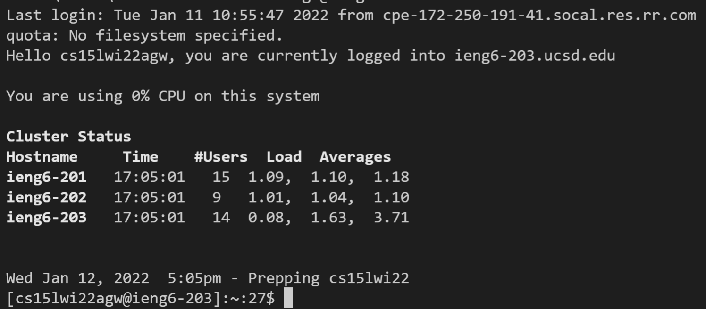
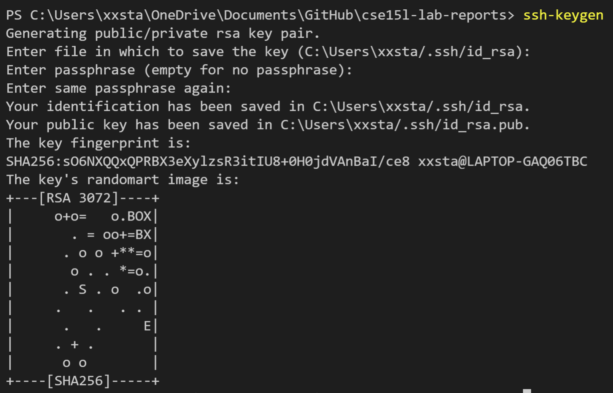
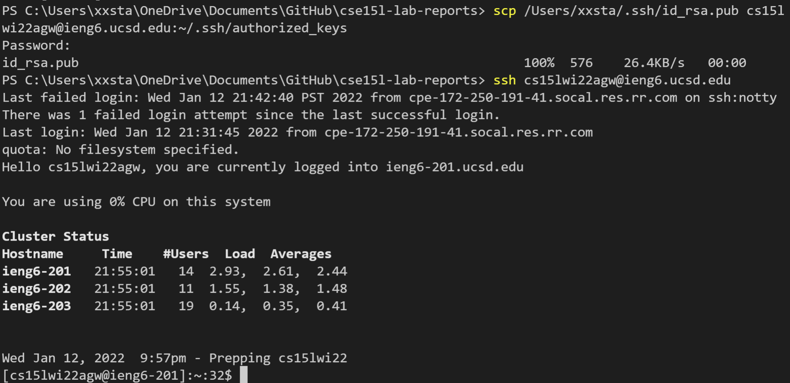

# **How to log into ieng6(Windows)**
## **1)Installing Visual Studio Code**
---
In order to install this, first go to the page [download link for vsc](https://code.visualstudio.com/download).
This is what the page should look like:   
Next, click the download button for your OS, i clicked windows.  
## **2) Remotely Connecting**
---
Try to find your username on [link](https://sdacs.ucsd.edu/~icc/index.php). Mine happens to be cs15lwi22agw. Then open vsc, and click terminal>new terminal.

* If you are on windows, download [OpenSSh](https://docs.microsoft.com/en-us/windows-server/administration/openssh/openssh_install_firstuse).  
* If it asks if you want to continue connecting, then type yes.  
* To ssh use this command: 
> `ssh <your username>@ieng6.ucsd.edu`
* For example: I would type 
> `ssh cs15lwi22agw@ieng6.ucsd.edu`
* Click enter. It will prompt you for your password, which you should type in, and click enter when you are done.  
  
This is what it should look like:
  
  
  If you did it correctly, it should change the information before your cursor and display: 
  

## **3)Trying Some Commands**
---

* Here I tried the commands ls, ls -a, cd WhereAmI.java, and cat.
* I tried to change directories to a file(you can only change directories to a folder), which didn't work. 
## **4)Moving Files with scp**
---
To move files, use the command 
>`scp <filename> <destination>`  

For example: 
>`scp WhereAmI.java cs15lwi22agw@ieng6.ucsd.edu:~/`  

* This will move a file called WhereAmI.java from the client computer to the home directory of the server computer.  

It should look like this ( if ls in the server, then you can see the file): 

## **5)Setting an SSH Key**
---
This saves time so you don't have to keep entering your password. Use this command:
> ssh-keygen

>scp /Users/xxsta/.ssh/id_rsa.pub cs15lwi22agw@ieng6.ucsd.edu:~/.ssh/authorized_keys  
* This moves the public key that was just generated into the .ssh file onto the server computer from the client computer.  

* It is now possible to ssh without a password
## **6)Optimizing Remote Running**
---
You can run multiple commands in the server computer by doing:
>ssh cs15lwi22agw@ieng6.ucsd.edu "javac WhereAmI.java; java WhereAmI"
* Note: " " allow us to specify for these commands to be run on the server
* Note: ; allows us to seperate commands.  

An example of this:

> scp WhereAmI.java cs15lwi22agw@ieng6.ucsd.edu:~/; ssh cs15lwi22agw@ieng6.ucsd.edu "javac WhereAmI.java; java WhereAmI"
* Translation: run scp of WhereAmI.java to home directory in server. Then ssh into ieng6 and thne compile and run WhereAmI.java.
